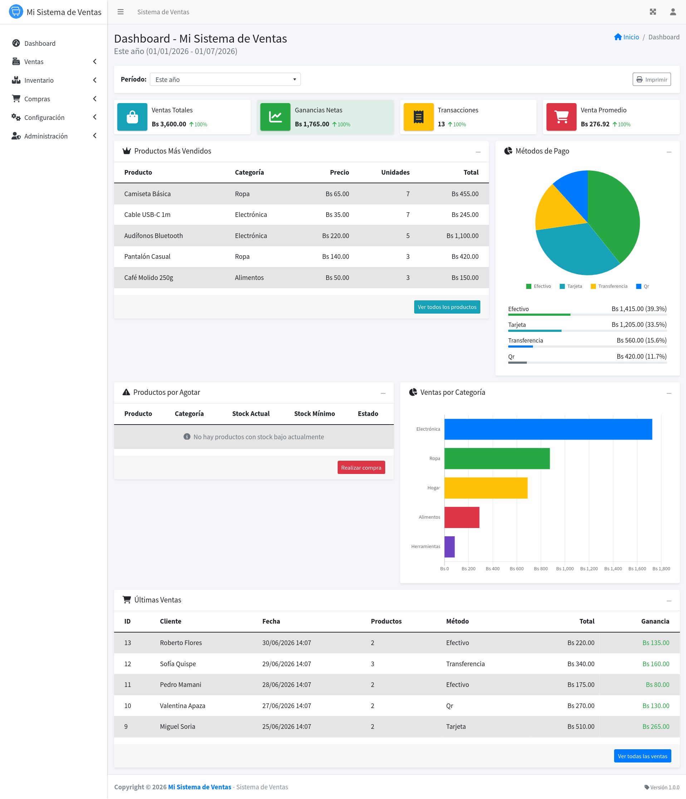
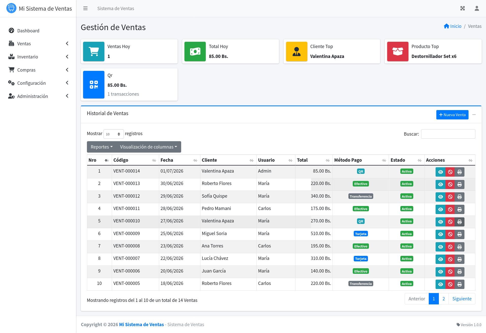
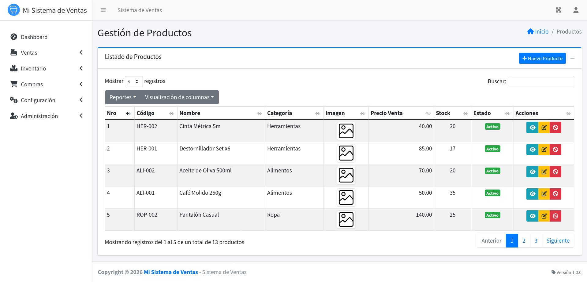

<div align="center">

# FlowPOS

Aplicación web open source para gestión de ventas e inventario, construida con PHP, MariaDB y AdminLTE.

Base reusable para proyectos de punto de venta y referencia de arquitectura MVC clásica sin framework.


</div>

## Características

- Gestión de ventas con detalle por ítems y métodos de pago mixtos.
- Control de inventario (stock, mínimos y máximos).
- Gestión de productos, categorías y clientes.
- Módulo de compras con actualización de stock.
- Paneles y accesos diferenciados por rol.
- Sistema de permisos granulares por usuario.
- Generación de comprobantes PDF con TCPDF.

## Stack técnico

| Capa      | Tecnologías                                                                 |
| --------- | --------------------------------------------------------------------------- |
| Backend   | PHP 7.4+, MariaDB/MySQL, PDO                                                |
| Frontend  | Bootstrap 4, AdminLTE 3, jQuery, Chart.js, DataTables, Select2, SweetAlert2 |
| Librerías | TCPDF, FontAwesome, Moment.js                                               |

## Screenshots

### Dashboard

Vista general con métricas clave de ventas e inventario para seguimiento operativo.



---

### Ventas

Flujo de registro de ventas con detalle de productos y métodos de pago.



---

### Productos

Gestión de catálogo, categorías, precios y control de stock.



## Requisitos

- Apache 2.4+ con `mod_rewrite`
- PHP 7.4+ con extensiones `pdo_mysql`, `gd`, `mbstring`, `zip`
- MariaDB 10.3+ o MySQL 5.7+
- XAMPP/LAMP (recomendado para entorno local)

## Puesta en marcha rápida

### 1. Clonar el repositorio

```bash
git clone <URL_DEL_REPOSITORIO>
cd FlowPOS
```

### 2. Configurar entorno

```bash
cp .env.example .env
```

Variables principales:

| Variable       | Descripción                      | Ejemplo                            |
| -------------- | -------------------------------- | ---------------------------------- |
| `APP_NAME`     | Nombre visible de la aplicación  | `FlowPOS`             |
| `APP_VERSION`  | Versión actual de la aplicación  | `1.0.0`                            |
| `APP_CURRENCY` | Símbolo de moneda                | `Bs`, `$`, `€`, `S/`               |
| `APP_URL`      | URL base (debe terminar con `/`) | `http://localhost/FlowPOS/` |
| `TIMEZONE`     | Zona horaria PHP                 | `America/La_Paz`                   |
| `DB_HOST`      | Host de base de datos            | `localhost`                        |
| `DB_NAME`      | Nombre de base de datos          | `flowpos`                   |
| `DB_USER`      | Usuario de base de datos         | `root`                             |
| `DB_PASS`      | Contraseña de base de datos      | ``                                 |
| `DEBUG`        | Modo debug (`true`/`false`)      | `false`                            |

### 3. Crear base de datos e importar esquema

```bash
mysql -u root -e "CREATE DATABASE flowpos CHARACTER SET utf8mb4;"
mysql -u root flowpos < schema.sql
```

### 4. (Opcional) Cargar datos de ejemplo

```bash
mysql -u root flowpos < seed.sql
```

Credenciales demo (si importaste `seed.sql`):

| Usuario               | Rol           | Clave      |
| --------------------- | ------------- | ---------- |
| `admin@demo.com`      | Administrador | `admin123` |
| `supervisor@demo.com` | Supervisor    | `admin123` |
| `vendedor@demo.com`   | Vendedor      | `admin123` |

### 5. Permisos de escritura para uploads

```bash
chmod 755 public/uploads/ public/uploads/productos/ public/uploads/clientes/ public/uploads/usuarios/
```

### 6. Iniciar servicios y abrir la app

```bash
sudo /opt/lampp/lampp start
```

Abrir: `http://localhost/FlowPOS/`

## Modelo de acceso

Roles disponibles:

- **Administrador**: acceso total.
- **Supervisor**: operación y control.
- **Vendedor**: flujo de venta y consulta.

Además del rol, la aplicación permite permisos granulares por usuario.

## Estructura del proyecto

```text
FlowPOS/
├── index.php
├── schema.sql
├── seed.sql
├── config/
├── controllers/
├── models/
├── services/
├── views/
├── libs/
└── public/
```

## Consideraciones de seguridad

- Cambia inmediatamente las credenciales demo en cualquier despliegue real.
- Usa `DEBUG=false` fuera de desarrollo.
- No publiques el archivo `.env`.
- Si trabajas con datos reales, configura HTTPS y credenciales de BD robustas.

## Changelog

El historial de cambios del proyecto está en [`CHANGELOG.md`](./CHANGELOG.md).

## Contribuciones

Las contribuciones son bienvenidas. Revisa primero la guía en [`CONTRIBUTING.md`](./CONTRIBUTING.md). Para cambios grandes, abre un issue antes del PR.

## Licencia

Distribuido bajo la licencia MIT. Ver el archivo [`LICENSE`](./LICENSE).

<div align="center">

---

Hecho con PHP + MariaDB para la comunidad open source.

</div>
