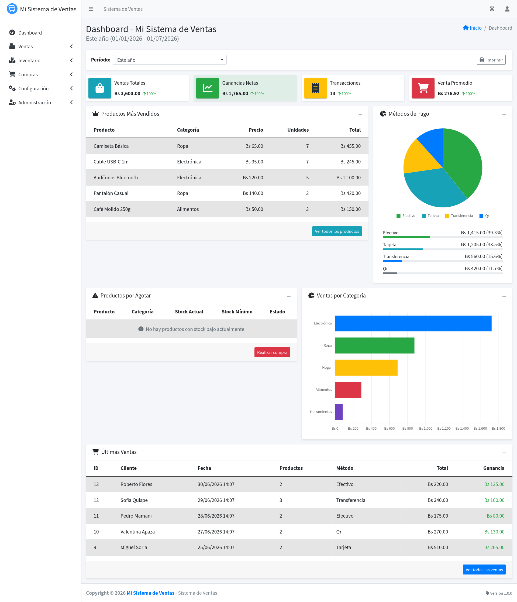
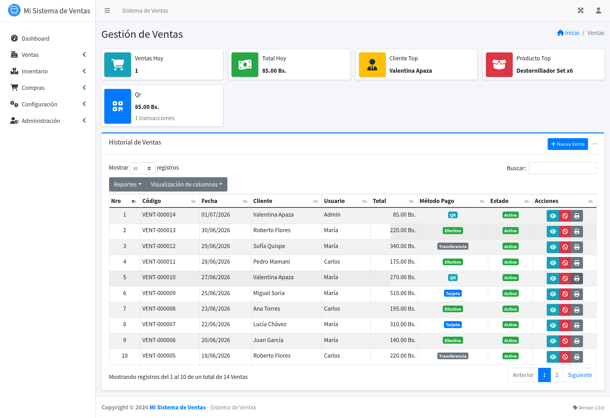
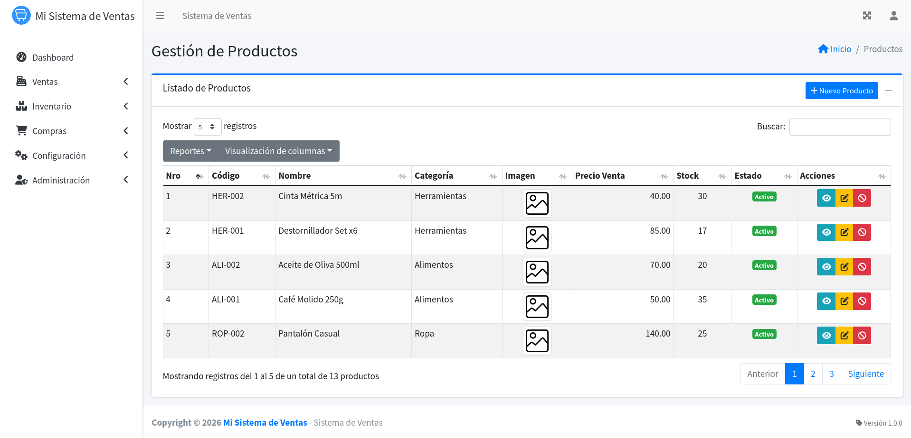

<div align="center">

# FlowPOS

Aplicación web open source para gestión de ventas e inventario, construida con PHP, MariaDB y AdminLTE.

Base reusable para proyectos de punto de venta y referencia de arquitectura MVC clásica sin framework.


</div>

## Características

- Gestión de ventas con detalle por ítems y métodos de pago mixtos.
- Control de inventario (stock, mínimos y máximos).
- Gestión de productos, categorías y clientes.
- Módulo de compras con actualización de stock.
- Paneles y accesos diferenciados por rol.
- Sistema de permisos granulares por rol.
- Generación de comprobantes PDF con TCPDF.

## Stack técnico

| Capa      | Tecnologías                                                                 |
| --------- | --------------------------------------------------------------------------- |
| Backend   | PHP 7.4+, MariaDB/MySQL, PDO                                                |
| Frontend  | Bootstrap 4, AdminLTE 3, jQuery, Chart.js, DataTables, Select2, SweetAlert2 |
| Librerías | TCPDF, FontAwesome, Moment.js                                               |

## Screenshots

### Dashboard

Vista general con métricas clave de ventas e inventario para seguimiento operativo.



---

### Ventas

Flujo de registro de ventas con detalle de productos y métodos de pago.



---

### Productos

Gestión de catálogo, categorías, precios y control de stock.



## Requisitos

- Apache 2.4+ con `mod_rewrite`
- PHP 7.4+ con extensiones `pdo_mysql`, `gd`, `mbstring`, `zip`
- MariaDB 10.3+ o MySQL 5.7+
- XAMPP/LAMP (recomendado para entorno local)

## Puesta en marcha rápida

### 1. Clonar el repositorio

```bash
git clone <URL_DEL_REPOSITORIO>
cd FlowPOS
```

### 2. Configurar entorno

```bash
cp .env.example .env
```

Variables principales:

| Variable       | Descripción                      | Ejemplo                     |
| -------------- | -------------------------------- | --------------------------- |
| `APP_NAME`     | Nombre visible de la aplicación  | `FlowPOS`                   |
| `APP_VERSION`  | Versión actual de la aplicación  | `1.2.5`                     |
| `APP_CURRENCY` | Símbolo de moneda                | `Bs`, `$`, `€`, `S/`        |
| `APP_URL`      | URL base (debe terminar con `/`) | `http://localhost/FlowPOS/` |
| `TIMEZONE`     | Zona horaria PHP                 | `America/La_Paz`            |
| `DB_HOST`      | Host de base de datos            | `localhost`                 |
| `DB_NAME`      | Nombre de base de datos          | `flowpos`                   |
| `DB_USER`      | Usuario de base de datos         | `root`                      |
| `DB_PASS`      | Contraseña de base de datos      | ``                          |
| `DEBUG`        | Modo debug (`true`/`false`)      | `false`                     |

### 3. Crear base de datos e importar esquema

```bash
mysql -u root -e "CREATE DATABASE flowpos CHARACTER SET utf8mb4;"
mysql -u root flowpos < database/schema.sql
```

### 4. (Opcional) Cargar datos de ejemplo

```bash
mysql -u root flowpos < database/seed.sql
```

Credenciales demo (si importaste `seed.sql`):

| Usuario               | Rol           | Clave      |
| --------------------- | ------------- | ---------- |
| `admin@demo.com`      | Administrador | `admin123` |
| `supervisor@demo.com` | Supervisor    | `admin123` |
| `vendedor@demo.com`   | Vendedor      | `admin123` |

### 5. Permisos de escritura para uploads

```bash
chmod 755 public/uploads/ public/uploads/productos/ public/uploads/clientes/ public/uploads/usuarios/
```

### 6. Iniciar servicios y abrir la app

```bash
sudo /opt/lampp/lampp start
```

Abrir: `http://localhost/FlowPOS/`

## Modelo de acceso

Roles disponibles:

- **Administrador**: acceso total.
- **Supervisor**: operación y control.
- **Vendedor**: flujo de venta y consulta. No puede anular ventas (reservado a supervisor/administrador).

Los permisos granulares se administran por rol (matriz rol×permiso en `views/roles/permisos.php`), no por usuario individual. Restricciones a nivel de acción puntual (como la anulación de ventas) se aplican con un rol-check en el controlador correspondiente.

## Estructura del proyecto

```text
FlowPOS/
├── index.php
├── database/
│   ├── schema.sql
│   ├── seed.sql
│   └── migrations/
├── config/
├── controllers/
├── models/
├── services/
├── views/
├── libs/
└── public/
```

## Consideraciones de seguridad

- Cambia inmediatamente las credenciales demo en cualquier despliegue real.
- Usa `DEBUG=false` fuera de desarrollo.
- No publiques el archivo `.env`.
- Si trabajas con datos reales, configura HTTPS y credenciales de BD robustas.
- Todos los formularios y endpoints AJAX de escritura están protegidos con CSRF (token de sesión validado en servidor); ver `CHANGELOG.md` [1.0.1].
- El login tiene protección contra fuerza bruta (rate limiting por cuenta e IP con ventana deslizante); ver `CHANGELOG.md` [1.1.0].
- Login y dashboards auditados y corregidos en accesibilidad (WCAG AA) y XSS de datos dinámicos; ver `CHANGELOG.md` [1.1.1].
- Corregido acceso no autorizado (IDOR) al detalle de ventas/compras de otros usuarios y desactivados permisos redundantes tras filtrar el historial por usuario; ver `CHANGELOG.md` [1.1.3].
- Corregido IDOR al anular ventas y al generar el comprobante PDF de ventas ajenas, y la autoría de venta (antes tomada de un campo de formulario, ahora siempre de la sesión); ver `CHANGELOG.md` [1.1.4].
- Nivelado el módulo de compras al mismo estándar de seguridad de ventas: eliminado endpoint huérfano vulnerable a IDOR, agregado ownership check en el cambio de estado, corregido doble escape en el detalle y payload de productos filtrado a solo activos en el formulario de creación; ver `CHANGELOG.md` [1.1.5].
- Corregida escalada de privilegios en el módulo de usuarios: un usuario no-administrador podía asignarse (o asignar a otro) el cargo Administrador, y podía degradar, cambiar la contraseña o desactivar una cuenta que ya era Administrador; ahora se valida tanto el cargo nuevo solicitado como el cargo actual del registro objetivo; ver `CHANGELOG.md` [1.1.6].
- Productos y clientes migrados al mismo formato de formulario (cards por sección) y estandarizada la confirmación de activar/desactivar en un único helper compartido, reduciendo la superficie de código duplicado entre módulos; ver `CHANGELOG.md` [1.1.7].
- Sistema de permisos migrado a control de acceso basado en roles (RBAC): asignación granular por usuario reemplazada por una matriz rol×permiso, con validaciones anti-escalada de privilegios basadas en el rol; ver `CHANGELOG.md` [1.2.0].
- Auditoría de accesibilidad del catálogo de permisos, barrido de contraste WCAG AA en callouts y paginación de DataTables, y anulación de ventas restringida al rol supervisor/administrador con un rol-check en el servidor (el POST directo del rol vendedor es rechazado); ver `CHANGELOG.md` [1.2.1].
- Auditoría de accesibilidad del módulo de roles (gestión y matriz de permisos): doble escape eliminado, matriz usable en móvil con columnas fijas y área táctil de 44px, contraste WCAG AA en botones/badges sólidos y anillo de foco de teclado restituido a nivel global; el botón "Desactivar" del último rol administrador activo se oculta; ver `CHANGELOG.md` [1.2.2].
- Auditoría de accesibilidad del módulo de compras (WCAG AA): nombres accesibles en botones icon-only y de colapso de panel, mensajes de error enlazados a sus campos (`aria-describedby` + `aria-invalid`) en el carrito y la fecha, contraste del modal de productos y del total de compra, y layout compartido (sidebar y navbar con landmarks y nombres accesibles, breadcrumb y footer con contraste mejorado); el área de toque táctil de 44px ahora cubre también los `.btn-sm` aislados con un `::before` que no agranda la caja visible; ver `CHANGELOG.md` [1.2.3].
- Auditoría de accesibilidad del módulo de usuarios (WCAG AA, 0 violaciones axe-core): contraste mejorado en pestañas inactivas de `card-outline-tabs`, enlaces/íconos del navbar y pills activos (global en `common.css`), nombre accesible en el botón de colapso, `role="presentation"` en los `<li>` de los tablists y `role="status"` en el badge de estado del avatar; `aria-selected` de las pestañas tipo pill sincronizado globalmente; reportes DataTables sin la columna de Imágen; confirmación de activar/desactivar migrada al helper compartido; previews de imagen sin `src="#"` y con `alt` descriptivo en español; ver `CHANGELOG.md` [1.2.4].
- **Refactor masivo del módulo Dashboard (1.2.5)**: eliminado ~1,200 líneas duplicadas entre `dashboard.js`, `dashboard_supervisor.js`, `dashboard_vendedor.js` extrayendo lógica compartida a `dashboard-core.js` (cache 5 min, fetch con manejo de errores, Chart.js 4+ config, selector de período, impresión de tickets, tablas accesibles para gráficos); autorización consistente vía `AuthorizationService::tienePermisoNombre()` con permisos granulares `dashboard_supervisor`/`dashboard_vendedor`; theming con CSS custom properties `--chart-color-*` y dark mode funcional; paridad de features en vendedor (período "Este año" y "Personalizado"); lazy-load de gráficos con IntersectionObserver; `APP_VERSION` sincronizado a 1.2.5; ver `CHANGELOG.md` [1.2.5].

## Changelog

El historial de cambios del proyecto está en [`CHANGELOG.md`](./CHANGELOG.md).

## Contribuciones

Las contribuciones son bienvenidas. Revisa primero la guía en [`CONTRIBUTING.md`](./CONTRIBUTING.md). Para cambios grandes, abre un issue antes del PR.

## Licencia

Distribuido bajo la licencia MIT. Ver el archivo [`LICENSE`](./LICENSE).

<div align="center">

---

Hecho con PHP + MariaDB para la comunidad open source.

</div>
